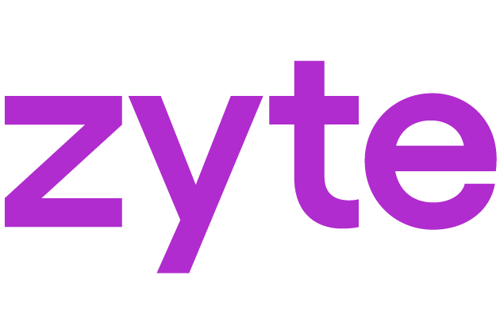

<p align="center">
  
</p>

<h1 align="center">Zyte Web Data for Claude Code</h1>

<p align="center">
  From a plain-English prompt to a working Scrapy spider.
</p>

<p align="center">
  
  
  
</p>

---

## Install

```bash
claude plugin marketplace add zyte-ai/claude-skills
claude plugin install zyte-web-data@zyte-ai
```

If Claude Code is already running, reload plugins in the active session:

```bash
/reload-plugins
```

See also: [Discovering and installing plugins](https://code.claude.com/docs/en/discover-plugins.md)

---

## What it does

This is Zyte's official [Claude Code](https://code.claude.com) plugin that builds a production-ready [Scrapy](https://scrapy.org) spider from a single prompt. Tell it a URL and what you want to extract. The plugin explores the site, discovers fields, and presents a schema for your approval. After you confirm, it generates [web-poet](https://web-poet.readthedocs.io) page objects, creates a Scrapy project with all dependencies configured, wires up the spider, and runs a smoke test to confirm extraction is working before handing the project back to you.

Optionally, use `/scrape-scrapy-cloud` to deploy directly to [Scrapy Cloud](https://www.zyte.com/scrapy-cloud/) for scheduled runs, job history, and monitoring. A [free tier is available](https://docs.zyte.com/scrapy-cloud/pricing.md).

---

## How it works

The `/scrape` skill orchestrates five stages:

```
1. Decide which fields to extract   →  /scrape-define
2. Analyze the website              →  /scrape-spec
3. Create the Scrapy project        →  /scrape-ensure-project
4. Generate the extraction code     →  /scrape-codegen
5. Generate the spider              →  /scrape-create-spider
```

Each stage feeds directly into the next. When the pipeline completes, you have a runnable spider and a passing test suite:

```bash
uv run scrapy crawl <spider_name>
uv run pytest fixtures/
```

---

## Skills

### Orchestration

| Skill | Description |
|---|---|
| `scrape` | End-to-end web scraping workflow — from URL to working spider with web-poet page objects |

### Pipeline stages (called automatically by `/scrape`)

| Skill | Description |
|---|---|
| `scrape-define` | Quick schema definition: explore one detail page, discover fields, fast approval loop |
| `scrape-spec` | Explore diverse pages and validate the extraction spec: downloads pages, compares variants, optional browser review |
| `scrape-explore-site` | Explore a website to find and save diverse pages (start, list, detail) with classified links |
| `scrape-analyze-page` | Extract all available fields with values from a detail page |
| `scrape-ensure-project` | Ensure a Scrapy project exists with scrapy-poet and Zyte API support |
| `scrape-codegen` | Generate web-poet page object code from an extraction spec |
| `scrape-codegen-analyze` | Analyze an HTML page to produce field extraction instructions for code generation |
| `scrape-codegen-generate` | Generate web-poet page object code from per-page extraction analyses |
| `scrape-create-spider` | Generate a Scrapy spider that wires page objects together |

### Utilities

| Skill | Description |
|---|---|
| `scrape-add-page-object` | Add an empty web-poet page object to a Scrapy project |
| `scrape-review-schema` | Generate an HTML review page for schema and extracted data verification |

### Deployment

| Skill | Description |
|---|---|
| `scrape-scrapy-cloud` | Deploy projects, schedule spiders, list/stop jobs, and view items or logs on [Scrapy Cloud](https://www.zyte.com/scrapy-cloud/) |
| `scrape-zyte-login` | Set up your Zyte account and credentials |

---

## Prerequisites

- [Claude Code](https://code.claude.com) (CLI or desktop app)
- [`uv`](https://docs.astral.sh/uv/) — used to create and manage the Scrapy project

Project dependencies (scrapy, scrapy-poet, scrapy-zyte-api, web-poet, extruct, price-parser, pytest) are installed automatically by the skills.

---

## Quickstart

The scraping skills are designed to pick up any scraping prompt automatically. For example:

```
Scrape https://books.toscrape.com/
```

The plugin will guide you through schema approval interactively, then generate a complete, tested Scrapy project.

---

## Update

We recommend enabling automatic updates:

1. Enter `/plugin` in a Claude Code session
2. Select **Marketplaces** → **zyte** → **Enable auto-update**

To update manually:

```bash
claude plugin marketplace update zyte-ai/claude-skills
```

Then, in a Claude Code session:

```bash
/reload-plugins
```

---

## Evaluation

We automatically evaluate skills and track both wall time and cost. We measure and aim to improve these metrics over time.

---

## Feedback

If you find any issue — such as prompts that did not work as expected, or that caused excessive wall time or cost — please [open a GitHub issue](https://github.com/zyte-ai/claude-skills/issues).

Provide as much detail as possible to help us reproduce the issue. You are welcome to anonymize target websites or other data.

---

## License

See [LICENSE.md](LICENSE.md) for the Zyte End User License Agreement.

---

## Demo

<p align="center">
  <a href="https://youtu.be/KU8DJISQYeM">
    
  </a>
</p>
